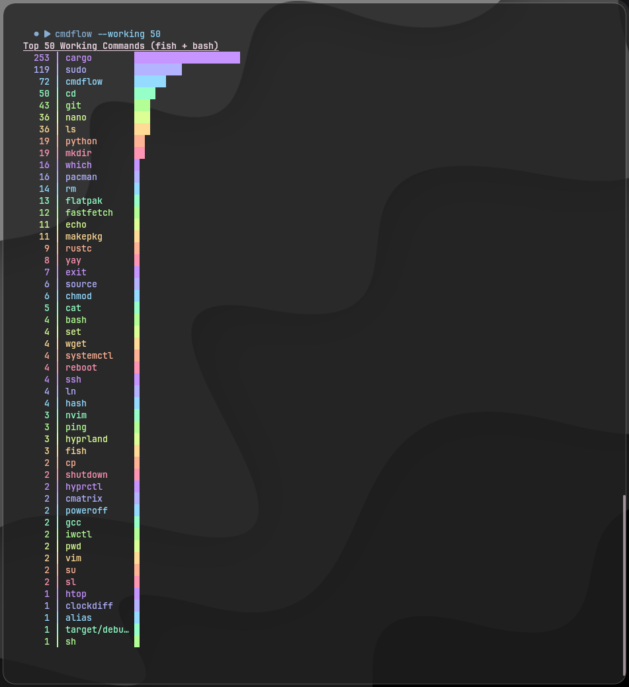

<h1 align="center">cmdflow🌈</h1>

<p align="center">
  
  
  
  
  
  
  
</p>

A colorful Fish/Bash/Zsh command tracker with rainbow top visualization 

`cmdflow` — это утилита для Linux, которая подсчитывает ваши команды Fish/Bash/Zsh, создаёт топ-N команд и выводит его в терминал.

- Автокеширование команд при каждом запуске  
- Поддержка старых и новых команд  
- Топ-N с медалями и цветными барами  
- Удобно для анализа вашей командной истории

---

###   Функционал

- Считает все введённые команды Fish и Bash, включая их повторы  
- Берёт только первые аргументы команд (например, `cargo build` → `cargo`)  
- Команды — радужная градиентная аллея  
- Автоматически обновляет лог при каждом запуске  

**Пример вывода `cmdflow --working 50`:**



---
⚠️ Важное примечание по поводу дубликатов команд

По умолчанию большинство шеллов (особенно Fish и Bash) используют режим ignoredups. Это значит, что если ты введешь команду fastfetch 5 раз подряд, в историю запишется только один вызов.

Чтобы графики в cmdflow отражали 100% реальную картину твоей активности, запусти встроенный фиксер конфигурации:
Bash

``cmdflow --fix-history``

Эта команда безопасно допишет необходимые хуки в ваши файлы ~/.bashrc и ~/.config/fish/config.fish, заставив их сохранять абсолютно каждый ввод. Удачи.

---

###   Установка

**Через GitHub:**

```bash
git clone https://github.com/voideez/cmdflow.git
cd cmdflow
cargo build --release
mkdir -p ~/.local/bin
ln -sf "$(pwd)/target/release/cmdflow" ~/.local/bin/cmdflow
```

**Через AUR:**

Если установлен `yay`:

```bash
yay -S cmdflow
```

Будет собрана свежая версия проекта через Cargo.  

---

Теперь команда `cmdflow` доступна в любом терминале:

```bash
cmdflow          # top 10 (fish + bash)
--fish           # only fish
--bash           # only bash
--zsh            # only zsh
cmdflow 15       # top 15 (fish + bash)
--fish 20        # top 20 (only fish)
--working        # only working commands
--broken         # only non-working commands
--fix-history    # history fix
```
---

###   Требования

- Cargo  
- Fish shell  
- Bash shell
- Zsh shell

---

###   Разработка

Клонируем проект:

```bash
git clone https://github.com/voideez/cmdflow.git
cd cmdflow
```

Сборка и запуск в режиме разработки:

```bash
cargo build
cargo run
```

После изменений можно обновить команду в терминале:

```bash
cargo build
ln -sf "$(pwd)/target/debug/cmdflow" ~/.local/bin/cmdflow
cmdflow
```
